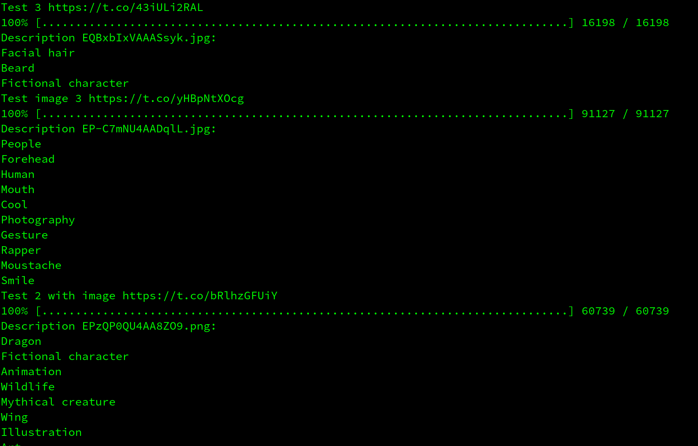
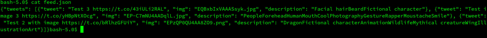

# Twitter Api
HW 2 Option 1:

My design utilizes tweepy to analyze one's twitter feed. If there is a picture attached to the tweet, it will then download and analyze the image using google vision. This will describe what the images look like.

To run the code:
First import your google application credientials:

ex) export GOOGLE_APPLICATION_CREDENTIALS="/home/nomal/Downloads/feedME-861c508014fe.json" 

Then run the following:
--> python3 feedMe.py

Running the code will only work if one replaces the tweepy keys with their own keys.

After running of the program, the tweets and descriptions will be outputted into the terminal. A json file will also be made to store the data from the analysis.

The following is the twitter feed being analyzed by my program:
 
  

The following is the results after running feedMe.py
 
  

The following is the resulting json file made to store the data.
 
  

In the directory in which the program is run. The images will be installed in their own respective formats: .jpg, .png, etc